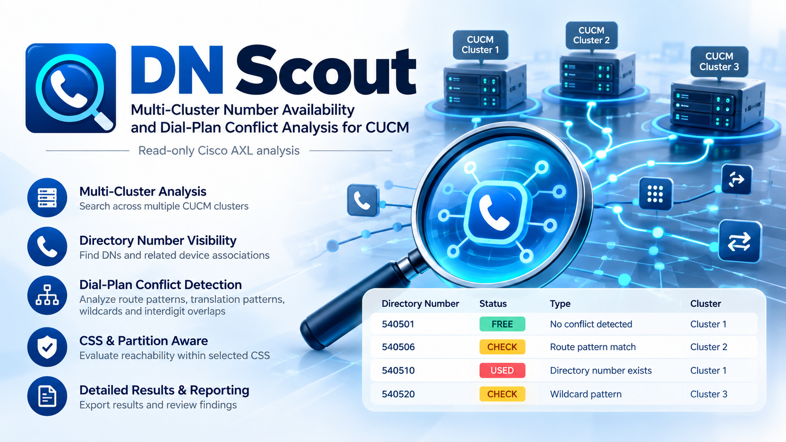
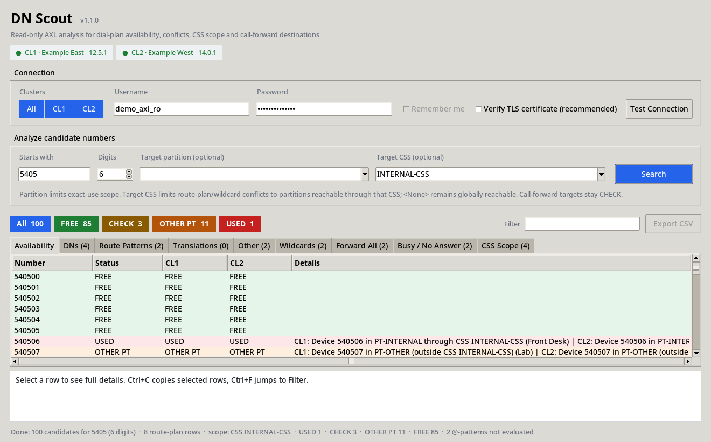

# DN Scout

[](https://github.com/ahmadalkayyali/dn-scout/actions/workflows/ci.yml)
[](https://github.com/ahmadalkayyali/dn-scout/releases)
[](LICENSE)

**Multi-Cluster Number Availability and Dial-Plan Conflict Analysis for CUCM**  
*Read-only Cisco AXL-powered analysis for Cisco Unified Communications Manager.*

DN Scout provides a single view of number availability and dial-plan interactions across as many as six CUCM clusters. It analyzes **Directory Numbers, partitions, Calling Search Spaces (CSS), route patterns, translation patterns, hunt/call-park and other route-plan objects, wildcard and interdigit overlaps, device associations, and call-forward destinations**. A candidate number can therefore be reviewed in the context of the broader dial plan instead of checking only the Directory Number page.



*Illustrative graphic; example cluster labels and numbers are fictional.*

### Application screenshot (synthetic data)



> **Important:** This tool is an administrative analysis aid, not a replacement for CUCM Digit Analysis. CSS-aware mode evaluates whether route-plan patterns are in partitions reachable through the selected CSS. It does not emulate every CUCM routing feature, composed line/device CSS behavior, transformations, time-of-day routing, local route groups, or runtime call state.

## What it analyzes

The tool is broader than an extension/DN finder. It correlates candidate numbers with the CUCM route plan and selected reachability scope, then explains why each candidate is **USED**, **OTHER PT**, **CHECK**, or **FREE**.

## Features

- **Multi-cluster search** – search 1 to 6 CUCM clusters in a single run, with per-cluster status columns.
- **Flexible number ranges** – search any numeric prefix from 1 to 15 total digits; it is not limited to six-digit extensions.
- **Partition-aware analysis** – optionally define the target partition for the new DN.
- **CSS-aware analysis** – optionally select a Calling Search Space and distinguish route-plan conflicts that are reachable through that CSS from patterns that exist only outside it. The CUCM null partition (`<None>`) is treated as globally reachable.
- **Route-plan coverage** – checks Directory Numbers, route patterns, translation patterns, hunt pilots, call park and other blocking `numplan` entries.
- **Wildcard analysis** – evaluates CUCM-style `X`, `!`, `?`, `+`, bracket ranges, negated ranges and dot delimiters; `@` numbering-plan patterns are reported but intentionally not evaluated.
- **Interdigit overlap detection** – identifies shorter/longer patterns that can create digit-analysis ambiguity or timeout risk.
- **Call-forward destination checks** – CFA, CFB, CFNA and CFUR, both internal and external variants where stored by CUCM.
- **Device visibility** – shows devices associated with matching DNs.
- **Read-only design** – uses `getCCMVersion` and read-only `executeSQLQuery` `SELECT` statements. The application never sends CUCM configuration writes.
- **Status model**
  - **USED** – an exact blocking route-plan object is in the requested scope.
  - **OTHER PT** – an exact/overlap conflict exists, but only outside the requested partition/CSS scope.
  - **CHECK** – wildcard/interdigit overlap or call-forward destination requires review.
  - **FREE** – no condition above was found by the checks performed by the tool.
- **Supporting tabs** – DNs, route patterns, translations, other route-plan entries, wildcards, forward destinations, and selected CSS membership.
- **Filters and export** – status chips, text filtering, sortable columns, full detail pane and CSV export.
- **Connection testing** – retrieves CUCM version, partitions and CSS names before a search.
- **Portable Windows build** – PyInstaller release for environments that do not have Python installed.
- **Diagnostics** – `axl_diag.py` checks proxy, TCP, TLS, authentication, schema behavior and the same application queries. `--public` mode removes sensitive response details for safer issue sharing.
- **Light/dark themes** – Windows-friendly UI using `sv-ttk` when available.

## Compatibility

The application has been validated against **Cisco Unified Communications Manager 12.5 and 14** environments. Other CUCM releases may work but should be treated as **unvalidated until tested**.

The application uses `executeSQLQuery`, so database-table compatibility matters in addition to the AXL schema version. Cisco documents `executeSQLQuery` as a read-only AXL operation for read-only users, but SQL table/column compatibility should not be assumed across every CUCM release.

Python source execution requires **Python 3.10 or later**. CI currently validates Python **3.10 and 3.12**.

## CUCM prerequisites for each cluster

1. Activate **Cisco AXL Web Service** on the publisher.
2. Create a dedicated CUCM application user for this tool.
3. Place the application user in an Access Control Group that has both read-only AXL roles:
   - **Standard AXL API Users**
   - **Standard AXL Read Only API Access**
4. Allow TCP **8443** from the workstation to each configured publisher.
5. For production use, configure a trusted Tomcat CA/certificate chain and enable **Verify TLS certificate**.

Do not use a personal CUCM administrator account unless your organization explicitly requires it.

## Quick start

### Option A – Windows executable

1. Download `DNScout-<version>-windows.zip` from GitHub Releases.
2. Extract it to a local folder.
3. Rename `cucm_clusters.example.json` to `cucm_clusters.json`.
4. Add the CUCM publisher FQDN/IP for each cluster.
5. Run `DNScout.exe`.
6. Enter the dedicated read-only AXL credentials and select **Test Connection**.
7. Enter a numeric prefix and total digit length.
8. Optionally select a target Partition and/or CSS.
9. Select **Search**.

### Option B – run from source

```bash
git clone https://github.com/ahmadalkayyali/dn-scout.git
cd dn-scout
python -m pip install -r requirements.txt
```

Windows:

```bat
copy cucm_clusters.example.json cucm_clusters.json
python dn_scout.py
```

macOS/Linux:

```bash
cp cucm_clusters.example.json cucm_clusters.json
python dn_scout.py
```

`tkinter` must be present in the Python installation.

## Example search

To evaluate the `5405xx` block:

- **Starts with:** `5405`
- **Digits:** `6`
- **Target partition:** optional, for example `PT-INTERNAL`
- **Target CSS:** optional, for example `CSS-INTERNAL`

The tool generates `540500` through `540599`, collects the relevant read-only CUCM data, evaluates the candidates locally, and provides an overall status plus a per-cluster status.

### How Partition and CSS scope interact

- With both fields blank, an exact blocking object in any partition is `USED`.
- With only **Target partition**, exact objects in that partition are `USED`; exact objects in other partitions are `OTHER PT`.
- With only **Target CSS**, exact objects in partitions contained in that CSS are `USED`; route-plan conflicts only outside the CSS are `OTHER PT`.
- With both fields populated, an exact object must satisfy both the requested partition and CSS scope to be `USED`.
- Objects in the null partition (`<None>`) are treated as reachable by CSS scope.
- Call-forward destinations remain `CHECK` even when CSS scope is selected because the forwarding source can use its own calling search space.

## Configuration – `cucm_clusters.json`

```json
{
  "clusters": [
    {"id": "CL1", "name": "Primary",   "host": "cucm1-pub.example.com", "axl_version": "12.5", "ca_bundle": ""},
    {"id": "CL2", "name": "Secondary", "host": "cucm2-pub.example.com", "axl_version": "14.0", "ca_bundle": ""},
    {"id": "CL3", "name": "Regional",  "host": "",                      "axl_version": "12.5", "ca_bundle": ""}
  ],
  "default_username": "",
  "flag_overlaps": true,
  "page_size": 2000,
  "max_candidates": 100000,
  "timeout_seconds": 60,
  "axl_retry_attempts": 4,
  "axl_retry_base_seconds": 2
}
```

| Key | Meaning |
|---|---|
| `id` | Short neutral cluster identifier shown in the UI; letters, digits, `-` and `_`, maximum 8 characters. |
| `name` | Optional friendly cluster label. |
| `host` | CUCM publisher FQDN/IP. Leave empty to hide the cluster. |
| `axl_version` | AXL schema requested by the client, such as `12.5` or `14.0`. HTTP 599 can trigger one alternate-schema attempt. |
| `ca_bundle` | PEM file containing the trusted CA/certificate chain used when TLS verification is enabled. Relative paths are allowed. |
| `default_username` | Optional username pre-fill; do not put passwords here. |
| `flag_overlaps` | Marks shorter/longer route-plan overlaps as conditions requiring review. |
| `page_size` | SQL rows requested per AXL page. |
| `max_candidates` | Safety limit for generated candidates in one search. |
| `timeout_seconds` | Per-request network timeout. |
| `axl_retry_attempts` | Maximum attempts for service-unavailable/throttling responses. |
| `axl_retry_base_seconds` | Base backoff delay used for HTTP 503/throttling retries. |

The configuration is re-read on every **Test Connection** and **Search**. `cucm_clusters.json` is in `.gitignore` so production hosts and optional saved credentials are not committed by default.

## AXL 503 and schema handling

HTTP **503 Service Unavailable** is handled as a service availability/throttling condition. The application keeps the same AXL schema and retries with backoff, using `Retry-After` when supplied.

HTTP **599** is treated as a possible unsupported AXL schema condition and can trigger one alternate-schema attempt. A 503 response does **not** change the selected AXL schema.

## TLS security

AXL credentials are carried over HTTPS. **Verify TLS certificate** is strongly recommended for production use.

The setting remains off by default because many CUCM deployments initially use internal or self-signed certificates. For a managed deployment, export/install the trusted CUCM Tomcat CA chain, set `ca_bundle` for each cluster and enable TLS verification.

Disabling certificate verification protects the traffic with TLS encryption but does not authenticate the remote certificate and therefore does not provide the same protection against an active man-in-the-middle attack.

## Saved credentials (optional, Windows)

When **Remember me** is enabled and a connection test succeeds, the tool can store:

```json
"saved_username": "axl-readonly",
"saved_password": "dpapi:AQAAANCMnd8BFdERjHoAwE/Cl+sBAAAA..."
```

The password is **never stored in plaintext by this feature**. It is encrypted using Windows DPAPI and bound to the current Windows user. A copied encrypted value normally cannot be decrypted by another Windows user or machine.

Turning **Remember me** off removes both saved credential keys. Public/team build logic strips saved credentials from packaged configuration files.

## Diagnostics and privacy

Private troubleshooting mode:

```bash
python axl_diag.py cucm-pub.example.com CL1 5405
```

A normal diagnostic log can contain sensitive environment details such as:

- hostnames and IP addresses;
- proxy configuration;
- cluster/partition/CSS names;
- dial-plan data and DNs;
- AXL response content.

Do **not** attach a normal log to a public issue without reviewing and sanitizing it.

For public issue sharing, use:

```bash
python axl_diag.py --public cucm-pub.example.com CL1 5405
```

Public mode masks the supplied host, username and prefix, masks IP addresses/URL hosts, suppresses proxy values, hides SQL text and replaces AXL response bodies with a size-only marker. Passwords are never logged in either mode.

## Troubleshooting

| Symptom | Typical interpretation |
|---|---|
| HTTP 401 | Authentication failed, or a read-only account attempted an unauthorized operation. |
| HTTP 403 | The account does not have sufficient AXL access. Verify the two read-only AXL roles. |
| HTTP 404 | AXL endpoint/service is not available on the configured node. |
| HTTP 503 | AXL is unavailable or throttling requests. The app retries with backoff without changing schema. |
| HTTP 599 | Requested AXL schema may not be supported by that CUCM release. |
| TLS verification failure | `ca_bundle` is missing/wrong or the certificate chain/hostname is not trusted. |
| Works direct but fails through proxy | A proxy is intercepting or blocking TCP 8443/HTTPS. |

## How it works

For each selected cluster the application performs read-only queries against CUCM configuration tables including `numplan`, `routepartition`, `typepatternusage`, `devicenumplanmap`, `device`, `callforwarddynamic`, `callingsearchspace`, and `callingsearchspacemember`.

The collected data is evaluated locally:

1. exact blocking patterns are classified by Partition/CSS scope;
2. wildcard patterns are compiled into a local matcher;
3. shorter/longer pattern overlap is detected;
4. call-forward destinations are compared with candidate numbers;
5. results from every selected cluster are combined into an overall status.

Calling/called-party transformation patterns and templates do not consume a number and are excluded from blocking status. `@` numbering-plan patterns are counted but not evaluated by the local wildcard engine.

## Building the Windows executable

```bat
build_exe.bat
```

creates a team build containing the local cluster configuration after removing saved credentials.

```bat
build_exe.bat public
```

creates a public build with only the sanitized example configuration.

Official GitHub releases run tests, build the executables and publish the Windows ZIP plus `SHA256SUMS.txt`.

## Verification

Before publishing or contributing:

```bash
python -m py_compile dn_scout.py axl_diag.py
python -m pytest -q tests
```

The v1.1.0 publication build contains 20 offline tests covering wildcard matching, availability logic, partition/CSS scope, null-partition behavior, AXL response parsing, schema fallback and HTTP 503 retry behavior.

## Repository safety

The public repository intentionally uses:

- example hostnames under `example.com`;
- synthetic DNs and devices in tests;
- no real CUCM credentials;
- `.gitignore` protection for local cluster configuration;
- public-safe diagnostic mode;
- example-only configuration in public release builds.

Before publishing screenshots or support logs, still review them for environment-specific information.

## Additional documentation

- [Architecture and security model](docs/ARCHITECTURE.md)
- [Live CUCM validation checklist](docs/VALIDATION.md)
- [Project naming and branding](docs/BRANDING.md)
- [Release notes](docs/releases/v1.1.0.md)
- [Roadmap](ROADMAP.md)


## Contributing

See [CONTRIBUTING.md](CONTRIBUTING.md). Security issues should be reported privately as described in [SECURITY.md](SECURITY.md).

## Third-party software

See [THIRD_PARTY_NOTICES.md](THIRD_PARTY_NOTICES.md).

## License

[MIT](LICENSE) © 2026 Ahmad Alkayyali

*Independent community project. Not affiliated with or endorsed by Cisco Systems, Inc. Cisco, Cisco Unified Communications Manager, Cisco Unified CM and Webex are trademarks or registered trademarks of Cisco Systems, Inc. and/or its affiliates.*


## Project naming

**DN Scout** is the product name. The repository is `dn-scout`; the Python entry point is `dn_scout.py` and the packaged Windows executable is `DNScout.exe`. This project is independent and not endorsed by Cisco.

**Existing users upgrading from a pre-release build:** Renaming changes the Windows DPAPI description and encryption entropy, so previously saved passwords will need to be entered again. Re-enter the AXL password and test the connection. No CUCM configuration is modified.
